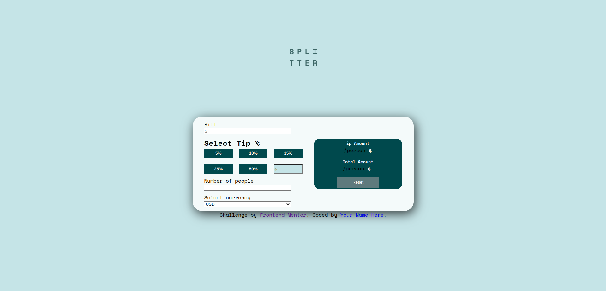

# Splitter - Tip Calculator

**Splitter** is a simple, intuitive web application that helps users calculate the tip amount per person and the total tip amount based on the entered bill amount and the number of people. It also offers a convenient feature to convert the calculated results into various currencies. The app is built using HTML, CSS, and JavaScript.

## Features

- **Tip Calculation**:

  - Enter the bill amount, tip percentage, and number of people to split the bill.
  - Calculate the tip amount per person.
  - Calculate the total tip amount.

- **Currency Conversion**:

  - Convert the tip results into one of the following currencies:
    - USD (United States Dollar)
    - EUR (Euro)
    - GBP (British Pound Sterling)
    - CHF (Swiss Franc)

- **Local Storage**:
  - Save the calculated results in local storage for future reference.

## Technologies Used

- **HTML**: For structuring the app's content.
- **CSS**: For styling the app to ensure a user-friendly interface.
- **JavaScript**: For handling the logic of tip calculation, currency conversion, and data storage.

## How to Use

1. Enter the **bill amount**.
2. Select the **tip percentage**.
3. Enter the **number of people** who will split the bill.
4. View the **tip amount per person** and the **total tip amount**.
5. Optionally, convert the results to your desired currency.
6. Your results will be automatically saved to local storage for later reference.

## Installation

1. Clone the repository:
   ```bash
   git clone https://github.com/yourusername/splitter.git
   ```
